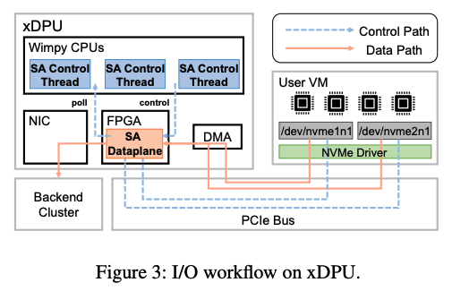
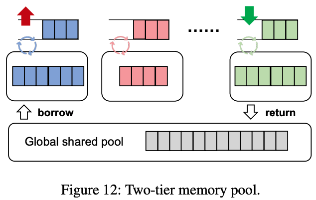
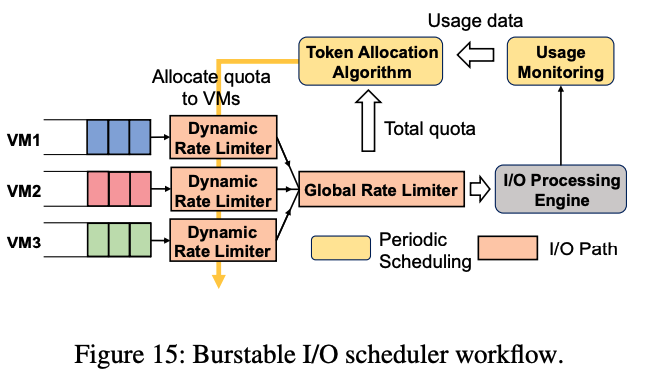

本文是北京大学和阿里云合作的工作，发表在OSDI2024上，介绍了一种名为BurstCBS的软硬协同设计的I/O调度系统，旨在解决CBS服务中的负载不平衡和租户干扰问题。

### 1. 摘要
本文观察到，在CBS中，连接用户虚拟机和后端存储的数据处理单元（DPU）上的存储代理（SA）是性能波动的主要来源。因此，提出了BurstCBS系统，利用高性能队列扩展实现了近乎完美的线速负载平衡，并设计了一个新的可扩展burstable I/O调度器，优先分配基础级别的资源，同时支持突发操作。

  

实验结果表明，BurstCBS可以将平均延迟降低高达85％，在拥堵情况下为基本级别租户提供高达5倍的吞吐量，并且具有最小的开销。此外，该文还通过验证一个内部依赖于CBS的数据库服务的工作负载，验证BurstCBS带来的收益，最高可达83％的延迟减少。

### 2. 主要问题
BurstCBS的设计旨在解决两个问题：
（i）缺乏控制线程之间的负载均衡；
（ii）缺乏租户之间的资源调度。

### 3. BurstCBS设计
高性能队列扩展：依赖xDPU硬件特性来平衡SA控制线程之间的I/O分布。然而，这给SA控制线程带来了额外的挑战，需要实现高性能的I/O处理。因此，提出了一个两层内存池，BurstCBS将空闲缓冲区在共享池和队列专用池之间移动，以高效利用有限的内存资源。

  

可扩展Burstable I/O调度器：具有性能隔离能力的突发带宽需要在多个共存租户之间非均匀且动态地分配资源。因此，设计了一个支持突发带宽的I/O调度器，定期在每个SA控制线程上运行以进行资源分配。该调度器允许每个租户在可能的情况下爆发，同时保持租户之间的性能干扰在可接受范围内。

  

向量化的I/O成本估算器：为每个租户分配正确的资源数量的关键是准确估计每个I/O的资源消耗。SA管理多种资源，包括CPU周期和互连带宽。这些资源中的任何一种都可能成为各种I/O模式下的瓶颈。因此，设计了一个向量化I/O成本估算器，将其与每种资源的估计解耦。

### 4. 总结
* 使用基于硬件的数据处理单元（DPUs）来提高性能和效率。
* 使用负载平衡机制实现高吞吐量和低延迟。
* 通过设计两层内存池解决资源调度问题。
* 引入可扩展的I/O调度器以支持突发性工作负载。
* 提供基本的性能保障并允许突发性的高负载行为。