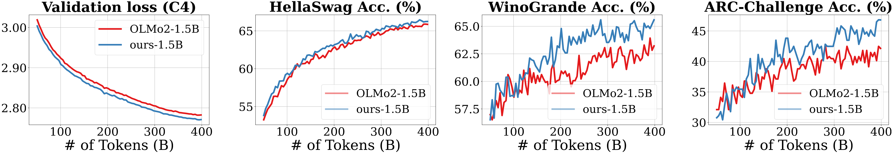

## 论文概述

缩放模型深度是大型语言模型（LLM）发展的关键驱动力。然而，随着模型层数加深，它们往往遭受**信号退化**问题：在浅层形成的信息特征被后续层的残差更新逐渐稀释，导致深层难以有效恢复这些信息。本文提出了**混合深度注意力机制**（Mixture-of-Depths Attention，MoDA），允许每个注意力头同时关注当前层的序列KV对以及前面各层的深度KV对，从而有效解决信息稀释问题。

## 核心创新

### 1. 混合深度注意力（MoDA）

MoDA 是一种统一的注意力机制，将标准的序列级注意力与深度级注意力融合到一个单一的softmax算子中。每个token可以同时关注：
- 当前层的序列级Keys和Values
- 来自之前所有层的深度级Keys和Values

这种方法通过数据依赖的方式动态聚合深度信息，既保留了DenseNet风格的无损信息传递，又避免了其高昂的参数开销。

### 2. 深度流设计空间

论文通过"读取-操作-写入"的三步视角分析Transformer堆叠，提出三种深度流机制：

- **深度残差（Depth Residual）**：标准残差连接，"读取"是恒等映射，"写入"是加法。问题在于深度流被持续压缩到固定大小的张量中，导致信息稀释。

- **深度密集（Depth Dense）**：连接所有层的深度流，通过拼接保留所有中间状态，但计算成本高达 O(TL²D²)，对于大模型来说过于昂贵。

- **深度注意力（Depth Attention）**：使用注意力机制以数据依赖的方式读取历史深度信息，计算成本降至 O(TL²D)。

- **MoDA**：在深度注意力基础上，将序列和深度注意力融合到单一算子中，是参数效率最高的方案。

### 3. 硬件高效实现

论文开发了一种硬件感知的MoDA实现，解决了非连续内存访问模式问题：

- **Flash兼容的深度KV布局**：将深度缓存展平为长度为 T×L 的单一轴，使深度查找兼容FlashAttention风格的内核。

- **分块感知的深度KV布局**：将查询分组为块，每个块只访问覆盖范围的本地深度KV区域，有效减少不必要的HBM流量。

- **分组感知的深度KV计算**：利用GQA特性，相邻的查询行共享相同的基础时间索引，可以复用相同的深度KV块。

该实现达到了FlashAttention-2在64K序列长度下97.3%的效率。

## 实验结果

### 主实验结果

在1.5B参数模型上，MoDA相比强基线OLMo2：
- 在10个验证基准上平均困惑度提升0.2
- 在10个下游任务上平均性能提升2.11%
- 仅增加3.7%的FLOPs计算开销

### 与后归一化的结合

研究发现，MoDA与后归一化（post-norm）结合使用比与预归一化（pre-norm）结合效果更好。

## 核心贡献总结

1. **提出MoDA**：一种统一的注意力公式，用于序列和深度的动态混合，以数据依赖的方式改善深度信息聚合，解决现代LLM的信息稀释问题。

2. **硬件高效融合算法**：使MoDA适用于长上下文LLM训练，在64K序列长度下达到FlashAttention-2效率的97.3%。

3. **广泛实证验证**：在多个模型规模的large-scale语料库上持续大幅优于强开源基线OLMo2，验证了每个设计选择，建立起MoDA作为LLM深度缩放可靠基础的地位。

## 代码与资源

- 论文代码：https://github.com/hustvl/MoDA
