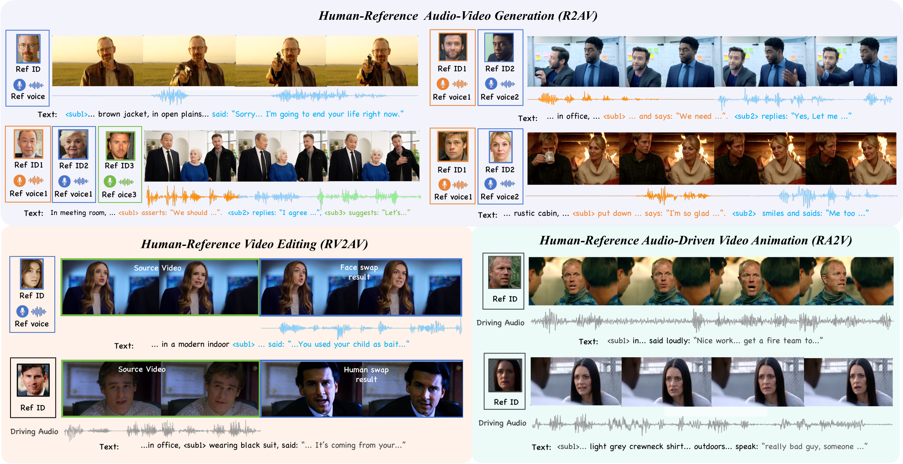
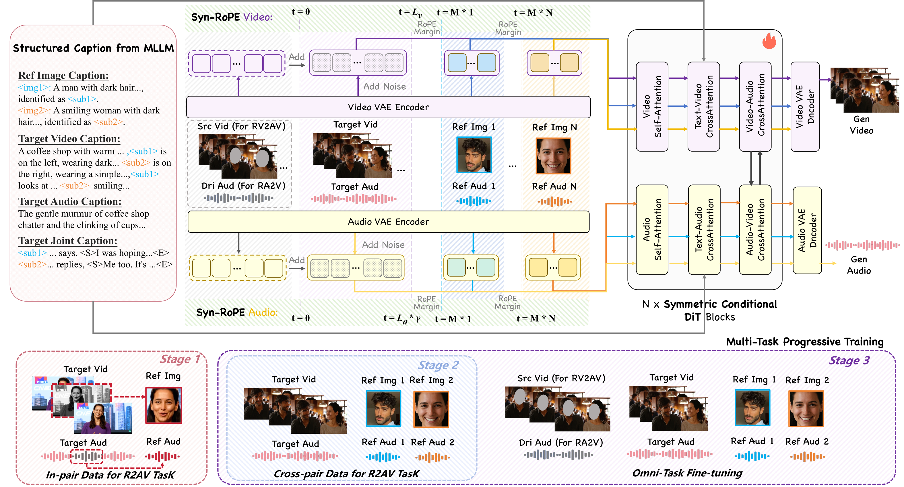
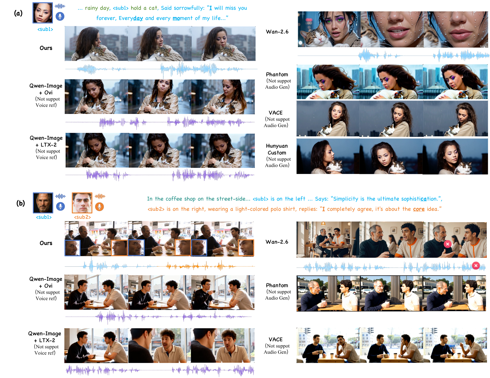

## 论文信息

- **论文标题**: DreamID-Omni: Unified Controllable Human-Centric Audio-Video Generation
- **arXiv ID**: 2602.12160

## 摘要

本文提出**DreamID-Omni**，一个统一的人类中心可控音视频生成框架。该框架基于双流Diffusion Transformer (DiT) 架构，将基于参考的生成（R2AV）、视频编辑（RV2AV）和音频驱动动画（RA2V）三种任务统一到单一范式中。

针对多人物场景中的身份-音色绑定和说话人混淆问题，DreamID-Omni提出了**双层解耦策略**：
- **信号层级**：通过同步旋转位置编码（Syn-RoPE）绑定身份与音色
- **语义层级**：通过结构化描述建立主体与属性的显式映射

此外，**多任务渐进式训练策略**有效协调了不同约束强度的任务，在IDBench-Omni基准上实现了跨视频、音频和音视频一致性的综合最优性能。

## 核心挑战

### 任务统一问题

当前可控人类中心生成存在三个主要任务，但各自独立：

| 任务 | 输入 | 输出 |
|------|------|------|
| R2AV | 文本 + 参考图像 + 参考音频 | 基于参考生成 |
| RV2AV | 文本 + 参考图像 + 参考音频 + 源视频 | 编辑视频中的身份和音频 |
| RA2V | 文本 + 参考图像 + 驱动音频 | 用音频驱动身份动画 |

这些任务本质上有共同的优化目标：将静态身份锚（图像和音频）映射到动态时空画布上。

### 多人物混淆问题

多人物生成面临两种混淆形式：
1. **身份-音色错配**：A人物发出B人物的声音
2. **属性-内容误归因**：A人物错误继承B人物的视觉属性和对话内容

这些问题源于两个层级的纠缠：
- **信号层级**：标准注意力机制无法将身份视觉特征与对应音色绑定
- **语义层级**：非结构化文本无法显式关联主体与属性

## 方法：DreamID-Omni

### 双流DiT架构

DreamID-Omni基于双流DiT架构，包含并行的视频流和音频流，通过双向交叉注意力层交互，实现精细的时序同步和语义对齐。



### 对称条件DiT

核心创新是将异构条件信号（参考图像、语音音色、源视频、驱动音频）统一到共享潜在空间：

```
X_v = [z_v; E_v(I)] + [E_v(V_src); 0]
X_a = [z_a; E_a(A)] + [E_a(A_dri); 0]
```

- 参考特征连接到噪声潜变量，让DiT块提取身份先验
- 结构条件通过逐元素加法注入，作为结构画布
- 通过空输入实现任务切换，无需架构变更

### 双层解耦策略

**Syn-RoPE（同步旋转位置编码）**

为解决信号层级的身份-音色绑定问题，Syn-RoPE：
1. 同步视频和音频流：缩放目标音频的RoPE频率（γ = L_v / L_a）
2. 分配非重叠时序位置段：将不同身份的视觉和音频特征映射到相同位置段

```
目标: [0, L-1]
身份1: [M, 2M-1]
身份2: [2M, 3M-1]
```

优势：
- **身份间解耦**：利用RoPE周期性，不同身份投影到不同旋转子空间
- **身份内同步**：同一身份的视觉和音频特征映射到相同位置段

**结构化描述（Structured Caption）**

在语义层级，通过结构化描述建立显式映射：
- 为每个身份生成锚token \<sub_k\>
- 描述分为视频描述、音频描述、联合描述
- 所有主体引用一致使用锚token



### 多任务渐进式训练

三阶段课程学习策略：

**阶段1：内部配对重建**
- 仅在R2AV任务上训练
- 从样本自身提取参考身份和音色
- 使用掩码重建损失防止简单复制

**阶段2：跨配对解耦**
- 参考身份和音色来自不同视频
- 强制模型学习真正的解耦表示
- 损失覆盖整个数据流

**阶段3：全任务微调**
- 混合R2AV、RV2AV、RA2V数据（比例4:3:3）
- 模型学会根据条件切换任务

关键洞察：先掌握弱约束的R2AV任务，建立强大的生成先验，再用于强约束任务，避免过拟合。

## 实验结果

### IDBench-Omni基准

作者构建了包含200个高质量样本的综合基准：
- 100个身份-音色-描述三元组用于生成评估
- 50个带掩码视频用于编辑评估
- 50个驱动音频用于动画评估

### R2AV任务对比

DreamID-Omni在R2AV任务上相比商业模型Wan2.6、开源级联pipeline（Qwen-Image + LTX-2/Ovi）取得更优或相当的结果。

关键优势：
- 正确绑定特定身份与其对应音色
- 相比基线模型保持更优的身份一致性



### RV2AV任务对比

相比VACE和HunyuanCustom：
- 视频质量（AES）、文本跟随（ViCLIP）、身份相似度（ID-Sim.）达到SOTA
- 额外展现出优秀的音频生成能力

### RA2V任务对比

相比Humo和HunyuanCustom：
- 唇音同步准确率与Humo相当
- 视频相关指标达到领先性能
- 多人物场景下避免说话人误归因错误

### 消融实验

**双层解耦效果**
- 无Structured Caption：文本跟随能力显著下降，说话人混淆率从0.08升至0.26
- 无Syn-RoPE：音色保真度严重下降，身份-音色错配影响唇音同步

**多任务渐进式训练效果**
- 仅In-pair Reconstruction：出现严重复制粘贴问题
- 仅Cross-pair Disentanglement：过于困难，无法学习基本表示
- 无OFT的朴素多任务：从一开始就联合训练所有任务，导致弱约束任务性能下降

## 结论

DreamID-Omni展示了统一可控人类中心音视频生成的可能性：

1. **统一框架**：单一模型支持生成、编辑、动画三种任务
2. **双层解耦**：Syn-RoPE + Structured Caption解决多人物混淆
3. **渐进训练**：多任务渐进式训练协调不同约束强度
4. **SOTA性能**：在视频、音频、音视频一致性上达到综合最优

该工作为未来统一可控音视频生成模型的发展奠定了基础。
