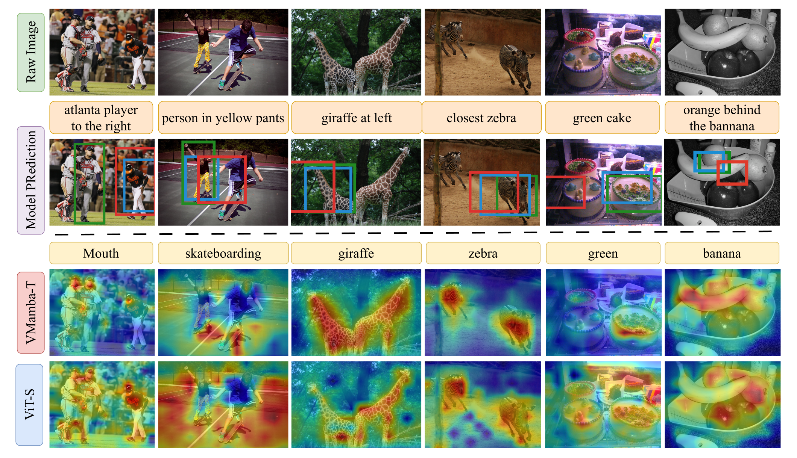

## 论文信息

- **论文标题**: SSM Vision Encoders for Visual Language Models
- **arXiv ID**: 2603.19209

## 摘要

视觉-语言模型（VLM）通常采用模块化设计：预训练的视觉编码器生成视觉token，轻量级连接器将其映射到大语言模型（LLM）的嵌入空间。当前大多数VLM仍依赖ViT家族的Transformer架构作为视觉骨干。

本文系统地研究了**状态空间模型（SSM）视觉编码器**在VLM中的潜力。通过严格的控制变量实验（backbone swap），作者发现：

1. 在匹配的IN1K/224设置下，VMamba在定位任务上显著优于ViT、MaxViT等架构
2. 密集预测预训练目标（检测/分割）可以进一步提升SSM和Transformer骨干的定位性能
3. ImageNet准确率和朴素的骨干规模扩展不能可靠预测下游VLM性能
4. 部分高分辨率检测预训练配置会出现"定位崩溃"（localization collapse），可通过增强连接器容量和调整接口几何来稳定

## 研究背景

### 当前VLM的架构选择

大多数VLM系统使用ViT家族的Transformer作为视觉编码器。尽管最近出现了混合架构（如MaxViT、MambaVision）和SSM架构（如VMamba），但缺乏系统性的对比研究。

### 核心问题

**是否存在更好的视觉表示，能够在不超过多模态token预算的情况下编码更丰富的空间信息？**

### SSM视觉编码器的优势

与依赖全局自注意力的ViT不同，SSM视觉模型（如VMamba）通过2D选择性扫描（SS2D）在2D网格上沿四个方向进行状态更新，将空间交互 baked into 架构本身。这种设计可能更好地保留空间结构。

## 方法：受控的骨干交换实验

### 实验框架

作者采用LLaVA风格的VLM架构，保持训练配方和视觉-语言接口不变，仅交换视觉骨干：

```
VLM架构 = 视觉编码器 + 连接器 + LLM（Vicuna-7B）
```

- **视觉编码器**：冻结，测试不同架构
- **连接器**：MLP，默认2层
- **LLM**：Vicuna-7B，指令微调

### 测试的骨干类型

1. **ViT**：全局自注意力的标准Transformer
2. **MaxViT**：层次化混合架构，结合卷积和多轴注意力
3. **MambaVision**：Mamba-Transformer混合骨干
4. **VMamba**：纯SSM骨干，2D选择性扫描

### 预训练目标对比

- **分类预训练**：IN1K supervised
- **检测预训练**：ViTDet、VMamba-Det
- **分割预训练**：ViT-Adapter、VMamba-Seg

### 评估基准

- **VQA任务**：VQA-v2, GQA, VizWiz, TextVQA, POPE, TallyQA
- **定位任务**：RefCOCO, RefCOCO+, RefCOCOg, OCID-Ref

## 主要发现

### 1. 匹配的IN1K/224骨干交换

在严格匹配的设置下（相同预训练数据、相同分辨率、相同token数量），VMamba-T/S在定位基准上始终领先，VMamba变体在整体VQA上也达到领先水平。

关键观察：
- ViT和MaxViT骨干，更高的IN1K准确率反而对应更低的VLM性能
- VMamba和MambaVision在小型规模上随扩展改善，但大型规模出现相同退化

### 2. 密集预测目标的影响

检测预训练可以改善或损害定位性能：
- **成功案例**：ViTDet-B和VMamba-S，检测适应提升了VQA和定位
- **失败案例**：ViTDet-L/H和VMamba-T/B，出现**定位崩溃**

分割预训练提供更稳定的提升：分割适应的VMamba在各规模上保持强劲表现。

### 3. 失败模式诊断

#### 目标过拟合

更大的模型可能过拟合于分类目标，导致特征仅保留用于分类显著物体的信息，而丢失大部分空间信息。这解释了为什么即使视觉骨干在ImageNet上表现良好，在VQA和定位基准上仍可能表现不佳。

SSM架构对此更具抵抗力，但随着模型规模增大，参数仍可能压过架构归纳偏置。

#### 定位崩溃

某些检测预训练配置出现急剧的定位崩溃。作者识别出两种瓶颈：

1. **传输瓶颈**：空间信息存在于视觉编码器中，但连接器容量不足以保留相关空间结构
2. **利用瓶颈**：即使视觉编码器编码了丰富空间信息，LLM也可能无法可靠解释和使用这些空间线索

### 4. 稳定性策略

作者测试了三种策略来稳定接口：

| 策略 | 效果 |
|------|------|
| 增强连接器容量（3层MLP） | 部分恢复定位崩溃 |
| 调整输入几何（方形512×512） | 消除崩溃，提升定位和VQA |
| 组合策略 | 最佳且最稳定的改进 |



## 因子化观点

本文提出VLM性能由三个因素共同决定：

1. **骨干架构**：具有更强空间归纳偏置的架构倾向于改进定位
2. **预训练目标**：密集预测目标改进了空间保真度
3. **视觉-语言接口**：连接器容量和输入几何影响空间信号的传输和利用

关键洞察：因素(ii)和(iii)很大程度上是架构无关的，可以跨不同骨干受益；而因素(i)在匹配的分类预训练下对鲁棒性仍然重要。

## 结论

本文系统地探索了SSM视觉编码器在VLM中的潜力：

1. **VMamba是强候选**：在匹配的IN1K/224设置下，VMamba变体达到最强整体表现
2. **密集预训练有益**：检测和分割预训练目标进一步改善VQA和定位
3. **规模扩展不可靠**：ImageNet准确率和朴素骨干扩展不能可靠预测VLM质量
4. **接口稳定性重要**：简单的架构无关稳定化（增强连接器、调整几何）可以互补地恢复性能

该工作为VLM设计提供了"骨干-目标-接口"的因子化视角，并表明SSM视觉编码器是VLM的一个有前景的、尺寸高效的选择。
